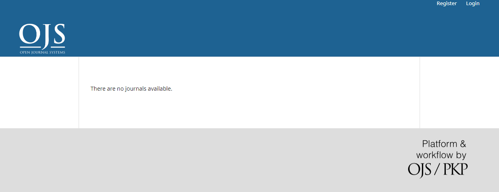

# Open Journal Systems CI/CD pipeline

Deploy Open Journal Systems server with CI/CD on Elestio

 
 

# Once deployed ...

You can open Open Journal Systems UI here:

    URL: https://[CI_CD_DOMAIN]
    login: "[ADMIN_EMAIL]"
    password: "[ADMIN_PASSWORD]"

You can open phpMyAdmin here:

    URL: https://[CI_CD_DOMAIN]:52440
    login: "root"
    password: "[ADMIN_PASSWORD]"
